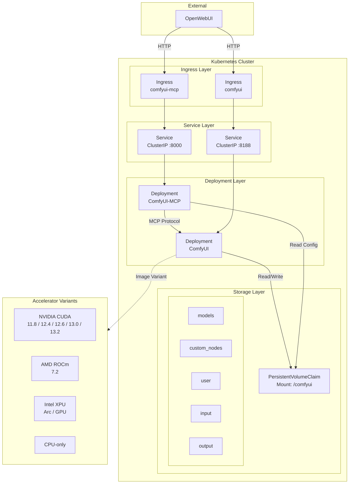

# ComfyUI Kubernetes Deployment

Production-ready Helm chart deployment for ComfyUI with multi-accelerator GPU support, MCP integration, and OpenWebUI connectivity.



## Prerequisites

- Kubernetes cluster (v1.28+)
- Helm 3
- kubectl configured with cluster admin access
- GPU operator for your accelerator (NVIDIA, AMD, or Intel)
- Docker/GHCR access for image pulls
- PersistentVolume (or StorageClass for dynamic provisioning)

## Quick Start

```bash
# Clone repository
git clone https://github.com/andreclaudino/comfyui-doker.git
cd comfyui-doker

# Install with Helm (NVIDIA CUDA 12.4 default)
helm install comfyui ./helm/comfyui \
  --namespace comfyui --create-namespace \
  --set comfyui.ingress.host=comfyui.example.com

# Verify deployment
kubectl get pods -n comfyui -w

# Access ComfyUI
# http://comfyui.example.com
```

## Build Docker Image (GitHub Actions)

The repository includes a GitHub Actions workflow for automated multi-accelerator builds.

### Accelerator Variants

| Variant | Dockerfile | Tags |
|---------|-----------|------|
| CUDA 11.8–13.2 | `docker/Dockerfile` | `latest-cuda11.8`, `latest-cuda12.4`, ..., `latest-cuda13.2` |
| ROCm 7.2 | `docker/Dockerfile.rocm` | `latest-rocm7.2` |
| Intel XPU | `docker/Dockerfile.intel` | `latest-intel` |
| CPU | `docker/Dockerfile.cpu` | `latest-cpu` |
| MCP Server | `docker/Dockerfile.mcp` | `latest` |

### Automatic Triggers
- Push to `main` branch
- Tag push (v*)
- Pull requests to `main`
- Manual workflow dispatch

### Manual Build
```bash
# Trigger via GitHub CLI
gh workflow run docker-publish.yml -f tag=v1.0.0

# Or via GitHub web UI: Actions > Build and Push Docker Image > Run workflow
```

### Image Tags Generated
- `latest-cuda12.4` (default, from main branch) + `latest` alias
- `v1.0.0-cuda12.4` (semver tags with accelerator suffix)
- `v1.0-cuda12.4` (major.minor)
- `sha-<commit>-cuda12.4` (commit SHA)
- `pr-<number>-cuda12.4` (pull requests)

### Registry
Images are pushed to: `ghcr.io/andreclaudino/comfyui-doker`

## Kubernetes Deployment with Helm

### Prerequisites

- Helm 3 installed
- kubectl configured with cluster access
- PersistentVolume or StorageClass available

### Quick Install

```bash
# Install with default values (NVIDIA CUDA 12.4)
helm install comfyui ./helm/comfyui \
  --namespace comfyui --create-namespace \
  --set comfyui.ingress.host=comfyui.your-domain.com
```

### Using a different accelerator

```bash
# CPU-only
helm install comfyui ./helm/comfyui \
  --namespace comfyui --create-namespace \
  --set comfyui.image.tag=latest-cpu \
  --set comfyui.gpu.vendor=cpu \
  --set comfyui.gpu.count=0 \
  --set comfyui.env.COMFYUI_ARGS="--listen 0.0.0.0 --port 8188 --cpu" \
  --set comfyui.ingress.host=comfyui.your-domain.com

# AMD ROCm
helm install comfyui ./helm/comfyui \
  --namespace comfyui --create-namespace \
  --set comfyui.image.tag=latest-rocm7.2 \
  --set comfyui.gpu.vendor=amd \
  --set comfyui.ingress.host=comfyui.your-domain.com

# Intel XPU
helm install comfyui ./helm/comfyui \
  --namespace comfyui --create-namespace \
  --set comfyui.image.tag=latest-intel \
  --set comfyui.gpu.vendor=intel \
  --set comfyui.ingress.host=comfyui.your-domain.com
```

### Verify Deployment

```bash
# Check all resources
kubectl get all -n comfyui

# Check pods
kubectl get pods -n comfyui -o wide

# Check PVC binding
kubectl get pvc -n comfyui

# Check ingress
kubectl get ingress -n comfyui

# View logs
kubectl logs -n comfyui -l app.kubernetes.io/name=comfyui -f
kubectl logs -n comfyui -l app.kubernetes.io/name=comfyui-mcp -f
```

### Generate MCP Token

```bash
# If using inline token, retrieve from secret
kubectl get secret -n comfyui comfyui-mcp -o jsonpath='{.data.MCP_TOKEN}' | base64 -d
```

### Upgrade

```bash
# Upgrade with Helm
helm upgrade comfyui ./helm/comfyui --namespace comfyui -f my-values.yaml

# Check upgrade history
helm history comfyui -n comfyui
```

### Uninstall

```bash
helm uninstall comfyui -n comfyui
```

See [docs/helm/](docs/helm/README.md) for complete documentation:
- [Installation Guide](docs/helm/INSTALL.md) — step-by-step with PV examples
- [Values Reference](docs/helm/VALUES.md) — complete configuration table
- [Examples](docs/helm/EXAMPLES.md) — scenarios for each accelerator

## OpenWebUI / MCP Integration

See [openwebui/mcp-config.md](openwebui/mcp-config.md) for detailed integration guide.

## MCP Integration

### OpenWebUI Configuration

See [openwebui/mcp-config.md](openwebui/mcp-config.md) for detailed integration guide.

Quick setup:
```json
{
  "mcp": {
    "servers": {
      "comfyui": {
        "url": "http://<mcp-ingress-host>/mcp",
        "headers": {
          "Authorization": "Bearer YOUR_MCP_TOKEN"
        },
        "enabled": true,
        "timeout": 300
      }
    }
  }
}
```

### Available MCP Tools

- `generate_image` - Text-to-image generation
- `queue_prompt` - Custom workflow execution
- `get_queue_status` - Queue monitoring
- `get_history` - Generation history
- `upload_image` - Image upload for img2img

### Testing MCP Connection

```bash
# Get token (if using inline token)
kubectl get secret -n comfyui <release-name>-comfyui-mcp -o jsonpath='{.data.MCP_TOKEN}' | base64 -d

# Test with curl
curl -X POST http://<mcp-host>/mcp \
  -H "Authorization: Bearer $TOKEN" \
  -H "Content-Type: application/json" \
  -d '{"jsonrpc":"2.0","method":"tools/list","id":1}'
```

## Troubleshooting

### Pod Stuck in Pending

```bash
# Check events
kubectl describe pod -n comfyui -l app.kubernetes.io/name=comfyui

# Common causes:
# - No GPU nodes available (check nodeSelector)
# - PVC not bound (check PV/StorageClass)
# - Resource requests exceed capacity
```

### GPU Not Available

```bash
# Verify GPU plugin
kubectl get nodes -o json | jq '.items[] | {name: .metadata.name, gpu: .status.capacity["nvidia.com/gpu"]}'

# Check NVIDIA device plugin
kubectl get pods -n kube-system -l name=nvidia-device-plugin-ds

# Verify GPU in pod
kubectl exec -n comfyui -it deploy/<release-name>-comfyui -- nvidia-smi
```

### PVC Not Binding

```bash
# Check PV/PVC status
kubectl get pv,pvc -n comfyui

# Check PVC events
kubectl describe pvc -n comfyui -l app.kubernetes.io/name=comfyui
```

### Image Pull Errors

```bash
# Check image pull secret
kubectl get secret -n comfyui

# For GHCR private images, create pull secret
kubectl create secret docker-registry ghcr-secret \
  --docker-server=ghcr.io \
  --docker-username=<github-username> \
  --docker-password=<github-token> \
  --namespace=comfyui
```

### Ingress Not Working

```bash
# Check ingress controller
kubectl get pods -n ingress-nginx

# Check ingress resource
kubectl describe ingress -n comfyui

# Check nginx logs
kubectl logs -n ingress-nginx -l app.kubernetes.io/name=ingress-nginx
```

### MCP Authentication Failures

```bash
# Verify token in secret
kubectl get secret -n comfyui -l app.kubernetes.io/name=comfyui-mcp -o jsonpath='{.data.MCP_TOKEN}' | base64 -d

# Check MCP pod logs
kubectl logs -n comfyui -l app.kubernetes.io/name=comfyui-mcp | grep -i auth
```

### Out of Memory / OOM Kills

```bash
# Check resource limits
kubectl describe pod -n comfyui -l app.kubernetes.io/name=comfyui | grep -A 10 Limits

# Increase memory limits via Helm
helm upgrade comfyui ./helm/comfyui -n comfyui \
  --set comfyui.resources.limits.memory=64Gi
```

### Custom Nodes Not Loading

```bash
# Check COMFYUI_CUSTOM_NODES env var
kubectl get deployment -n comfyui -l app.kubernetes.io/name=comfyui \
  -o jsonpath='{.items[0].spec.template.spec.containers[0].env[?(@.name=="COMFYUI_CUSTOM_NODES")].value}'

# Add custom nodes via Helm upgrade
helm upgrade comfyui ./helm/comfyui -n comfyui \
  --set comfyui.env.COMFYUI_CUSTOM_NODES="https://github.com/ltdrdata/ComfyUI-Manager.git,https://github.com/cubiq/ComfyUI_essentials.git"
```

## License

MIT License - Copyright (c) 2025 Andre Claudino

See [LICENSE](LICENSE) for details.