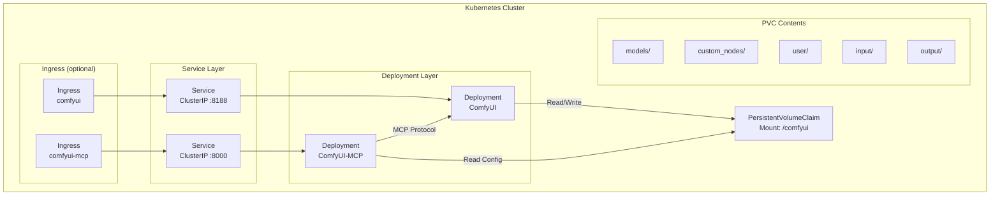

# ComfyUI Helm Chart

A portable, configurable Helm chart for deploying [ComfyUI](https://github.com/comfyanonymous/ComfyUI) on Kubernetes with multi-accelerator GPU support.

## Architecture



## Prerequisites

- Kubernetes cluster (v1.28+)
- Helm 3
- kubectl configured with cluster access
- GPU operator for your accelerator type (NVIDIA, AMD, Intel)
- PersistentVolume matching your storage class

## Accelerator Support

| Variant | Dockerfile | Image Tag | Requirements |
|---------|-----------|-----------|--------------|
| CUDA 11.8 | `docker/Dockerfile` | `latest-cuda11.8` | NVIDIA GPU, PyTorch 2.7.0 |
| CUDA 12.4 | `docker/Dockerfile` | `latest-cuda12.4` (default) | NVIDIA GPU, PyTorch 2.6.0 |
| CUDA 12.6 | `docker/Dockerfile` | `latest-cuda12.6` | NVIDIA GPU, PyTorch 2.7.0 |
| CUDA 12.8 | `docker/Dockerfile` | `latest-cuda12.8` | NVIDIA GPU, PyTorch 2.7.0 |
| CUDA 13.0 | `docker/Dockerfile` | `latest-cuda13.0` | NVIDIA GPU, PyTorch 2.11.0 |
| CUDA 13.2 | `docker/Dockerfile` | `latest-cuda13.2` | NVIDIA GPU, PyTorch 2.12.1 |
| ROCm 7.2 | `docker/Dockerfile.rocm` | `latest-rocm7.2` | AMD GPU, ROCm 7.2 |
| Intel XPU | `docker/Dockerfile.intel` | `latest-intel` | Intel Arc/GPU, compute runtime |
| CPU | `docker/Dockerfile.cpu` | `latest-cpu` | No GPU required |

## Quick Start

```bash
# Add the chart (from local checkout)
cd comfyui-doker

# Install with default values (NVIDIA CUDA 12.4)
helm install comfyui ./helm/comfyui \
  --namespace comfyui \
  --create-namespace \
  --set comfyui.ingress.host=comfyui.example.com

# Check status
helm ls -n comfyui
kubectl get pods -n comfyui -w
```

## Documentation

- [Installation Guide](INSTALL.md) — step-by-step install, upgrade, uninstall
- [Values Reference](VALUES.md) — complete configuration table
- [Examples](EXAMPLES.md) — concrete scenarios for each accelerator
